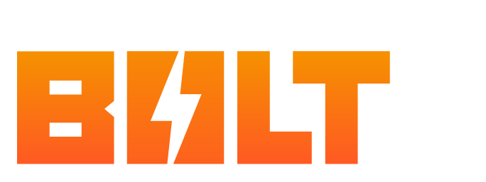

Adobe CEP 拡張機能を React、Vue、または Svelte で構築するための、Vite + TypeScript + Sass を基盤とした超高速ボイラープレート


[](https://github.com/hyperbrew/bolt-cep/blob/master/LICENSE)
[](https://discord.gg/PC3EvvuRbc)

## 特徴

- 超高速ホットモジュールリプレースメント（HMR）
- JavaScript と ExtendScript レイヤーの両方でモダンな ES6 を記述
- Types-for-Adobe を使用した型安全な ExtendScript
- evalTS()によるエンドツーエンドの型安全性
- cep.config.ts で簡単に設定可能
- 単一またはマルチパネル拡張機能のセットアップ
- 複数のホストアプリケーション設定をサポート
- 最適化されたビルドサイズ
- 配布用に ZXP への簡単な公開
- サイドカーアセットを含む ZIP アーカイブへの簡単なパッケージ化
- ZXP リリース用の GitHub Actions がすぐに使用可能

_詳細なブログ投稿:_ https://hyperbrew.co/blog/bolt-cep-build-extensions-faster/

### 開発要件

- [Node.js](https://nodejs.org/en) 16 以上
- [Yarn](https://yarnpkg.com/getting-started/install) 1.x.x（クラシック）（`yarn set version classic`を実行して確認）

### 互換性

- [Adobe CC Apps](https://www.adobe.com/creativecloud/desktop-app.html) 2022 以降のバージョン
- Windows & Mac Intel
- Mac Arm64 (M1 / M2) は特別なセットアップが必要（[詳細はこちら](#misc-troubleshooting)）

---

## 支援者

このプロジェクトを可能にしてくれた支援者の皆様に大きな感謝を！

<a href="https://battleaxe.co/" target="_blank">
</a>

このオープンソースプロジェクトを支援したい方は、[Hyper Brew チームにご連絡ください](https://hyperbrew.co/contact/)。

---

## Bolt CEP で構築されたツール

Rubberhose 3、Klutz GPT、Brevity などのツールは Bolt CEP によって動作しています！Bolt CEP で構築されたツールの完全なライブラリをご覧ください：

[Bolt CEP で構築されたツール](https://hyperbrew.co/resources/bolt-cep/)


---

## サポート

### 無料サポート 🙌

Bolt CEP の使用を開始する際に質問がある場合は、無料の Discord コミュニティでお気軽に質問し、議論してください。[Discord Community](https://discord.gg/PC3EvvuRbc)

### 有料優先サポート 🥇

Bolt CEP を使用したコンサルティングや開発に興味があるチームは、[Hyper Brew チームにご連絡ください](https://hyperbrew.co/contact/)。詳細は[Adobe プラグイン開発とコンサルティングサービス](https://hyperbrew.co/landings/boost-development)をご覧ください。

---

## Bolt CEP を無料または商用プロジェクトで使用できますか？

はい！Bolt CEP は**100%無料でオープンソース**であり、MIT ライセンスの下でリリースされています。帰属は必要ありません。これは、無料または商用プロジェクトで自由に使用できることを意味します。

製品のサイトやアバウトページにこのツールの情報ページへのリンクを提供していただけると大変ありがたいです：

Bolt CEP 情報ページリンク: https://hyperbrew.co/resources/bolt-cep

**Bolt CEP で構築された**ボタンのグラフィック：

**PNG ファイル**

<div style="display:flex;gap:1rem;">
<a href="./src/js/assets/built-with-bolt-cep/Built_With_BOLT_CEP_Logo_White_V01.png" target="_blank">
</a>

<a href="./src/js/assets/built-with-bolt-cep/Built_With_BOLT_CEP_Logo_Black_V01.png" target="_blank">
</a>

</div>

**SVG ファイル**

<div style="display:flex;gap:1rem;">
<a href="src/js/assets/built-with-bolt-cep/Built_With_BOLT_CEP_Logo_White_V01.svg" target="_blank">
</a>

<a href="src/js/assets/built-with-bolt-cep/Built_With_BOLT_CEP_Logo_Black_V01.svg" target="_blank">
</a>
</div>

## クイックスタート


`yarn create bolt-cep`

- 拡張機能の作成

`cd myApp`

- ディレクトリに移動

`yarn`

- すべての依存関係をインストール

`yarn build`

- 初期ビルドを実行
- cep フォルダ構造を作成
- 拡張機能フォルダへのシンボリックリンクを作成

`yarn dev`

- HMR ホットリロードを使用して開発モードで実行
- JS と ExtendScript フォルダの両方が変更時に再ビルド
- ブラウザで localhost:3000/panel/で表示可能
  - (例: http://localhost:3000/main/, http://localhost:3000/settings/など（複数のパネルを設定するには[パネル構造](#cep-panel-structure)を参照）)

`yarn serve`

- `yarn build`を実行した後にファイルを提供
- ブラウザで localhost:5000/panel/で表示可能
  - (例: http://localhost:5000/main/, http://localhost:5000/settings/など（複数のパネルを設定するには[パネル構造](#cep-panel-structure)を参照）)

`yarn zxp`

- プロジェクトをビルドして zxp にバンドルし、`dist/zxp`フォルダに公開

`yarn zip`

- zxp と指定されたアセットを ZIP アーカイブにバンドルし、`dist/zip`フォルダに保存

---

## 設定

`cep.config.ts`で CEP のビルドとパッケージ設定を安全に更新

`src/js/main/index(.tsx or .vue or .svelte)`でアプリの構築を開始

`src/jsx/main.ts`で ExtendScript コードを記述

---

## CEP パネル構造

各パネルは独自のページとして扱われ、効率のために共有コードが使用されます。このボイラープレートには現在、`main`と`settings`の 2 つのパネルが含まれています。これらは`cep.config.ts`で設定されています。

各パネルはそれぞれのフォルダで編集できます：

```
src
 └─ js
    ├─ main
    │   ├─ index.html
    |   └─ index.tsx
    └─ settings
        ├─ index.html
        └─ index.tsx
```

パネルを追加するには、`cep.config.ts`のパネルオブジェクトに項目を追加し、フォルダ構造を複製して必要に応じて調整します。

---

## ExtendScript

ExtendScript は ES6 で記述でき、互換性のために単一の ES3 ファイルにコンパイルされます。

JSON 2 はデフォルトで含まれており、include ディレクティブで追加された外部 JS ライブラリもバンドルされます：

```js
// @include './lib/library.js'
```

アプリ固有のコードは、`index.ts`でアプリケーション名として見られるモジュールに分割され、型安全な開発が可能です。

```
aftereffects >> aeft/aeft.ts
illustrator >> ilst/ilst.ts
animate >> anim/anim.ts
```

これらの個別のモジュールにアプリ固有の関数を記述し、各アプリケーションごとに必要とされます。

追加のホストアプリをサポートするには：

- 追加のアプリモジュールファイル（aeft.ts、anim.ts など）を追加します。
- `scr/jsx/index.ts`のメイン`switch()`に追加します。
- `cep.config.ts`ファイルにホストを追加します。

---

## CEP JavaScript から ExtendScript を呼び出す

すべての ExtendScript 関数は、`evalTS()`と`evalES()`を使用する際に名前空間の衝突を避けるために、バックグラウンドでパネルの名前空間に追加されます。

`evalTS()`を使用して CEP から ExtendScript と対話するための新しく改善されたエンドツーエンドの型安全な方法を導入しました。この関数は、ExtendScript 関数から動的に型を推論し、結果の文字列化と解析を処理するため、開発者の対話が可能な限りシンプルになります。

`main.tsx`で示されているように、ExtendScript 関数は関数名と引数を渡すことで`evalTS()`で呼び出すことができます。

CEP

```js
evalTS("myFunc", "test").then((res) => {
  console.log(res);
});

evalTS("myFuncObj", { height: 90, width: 100 }).then((res) => {
  console.log(res.x);
  console.log(res.y);
});
```

ExtendScript

```js
export const myFunc = (str: string) => {
  return str;
};

export const myFuncObj = (obj: { height: number, width: number }) => {
  return {
    y: obj.height,
    x: obj.width,
  };
};
```

既存の Bolt CEP プロジェクトでは、`main.tsx`で示されているように、従来の`evalES()`関数が通常通り残っています。

```js
evalES(`helloWorld("${csi.getApplicationID()}")`);
```

また、グローバルスコープで ExtendScript 関数を直接呼び出す場合は、2 番目のパラメータに`true`を渡してこの関数を使用することもできます：

```js
evalES(
  `alert("Hello from ExtendScript :: " + app.appName + " " + app.version)`,
  true
);
```

---

## ExtendScript から CEP JavaScript を呼び出す

イベントリスナーにフックしたり、長い関数の間に更新を送信したりする特定の状況では、ExtendScript 環境から JavaScript 環境にイベントをトリガーすることが理にかなっています。これは`listenTS()`と`dispatchTS()`を使用して行うことができます。

この方法を使用することで、以下のことが考慮されます：

- CSEvent のための JS 側でのスコープされたリスナーの設定
- ExtendScript 側での PlugPlug CSEvent イベントの設定
- イベントのエンドツーエンドの型安全性の確保

### 1. shared/universals.ts の EventTS でイベントタイプを宣言

```js
export type EventTS = {
  myCustomEvent: {
    oneValue: string,
    anotherValue: number,
  },
  // [... 他のイベント]
};
```

### 2. CEP JavaScript でリッスン

```js
import { listenTS } from "../lib/utils/bolt";

listenTS("myCustomEvent", (data) => {
  console.log("oneValue is", data.oneValue);
  console.log("anotherValue is", data.anotherValue);
});
```

### 3. ExtendScript でディスパッチ

```js
import { dispatchTS } from "../utils/utils";

dispatchTS("myCustomEvent", { oneValue: "name", anotherValue: 20 });
```

また、`dispatchTS()`は CEP 側から同様に使用して、CEP パネル内または間でイベントをトリガーすることもできます。`js`フォルダ内の正しいファイルから dispatchTS()関数をインポートしていることを確認してください。

```js
import { dispatchTS } from "../lib/utils/bolt";

dispatchTS("myCustomEvent", { oneValue: "name", anotherValue: 20 });
```

---

## GitHub Actions ZXP リリース

このリポジトリには、git タグが追加されるたびに ZXP をビルドしてリリースに追加するための GitHub Action ワークフローが設定されています。

```
git tag 1.0.0
git push origin --tags
```

その後、新しいビルドが GitHub リリースで利用可能になります。

---

---

## アセットのコピー

バンドラーに影響されずにコピーしたいアセットがある場合は、`cep.config.ts`内のオプションの`copyAssets:[]`配列にファイルまたはフォルダ全体を追加できます。

```js
  copyAssets: ["public", "custom/my.jsx"],
```

**例：**

`src/public`に配置されたファイルは、`copyAssets: ["public"]`の設定で`dist/public`にコピーされます。

---

---

## ZIP アセットのコピー

zxp と一緒に ZIP アーカイブにコピーしたいアセットがある場合は、`cep.config.ts`内のオプションの`copyZipAssets:[]`配列にファイルまたはフォルダ全体を追加できます。フォルダの末尾に"/\*"を付けると、フォルダ構造なしで内容が ZIP の宛先にコピーされます。

```js
  copyZipAssets: ["instructions/*", "icons"],
```

---

## カスタムポニーフィル

グローバルプロトタイプを変更するポリフィルとは異なり、ポニーフィルはカスタムメソッドで機能を置き換えます。組み込みのポニーフィルには以下が含まれます：

- Object.freeze()
- Array.isArray()

独自のポニーフィルを追加するには、`vite.es.config.ts`の`jsxPonyfill()`関数に渡します：

```js
jsxPonyfill([
  {
    find: "Array.isArray",
    replace: "__isArray",
    inject: `function __isArray(arr) { try { return arr instanceof Array; } catch (e) { return false; } };`,
  },
]);
```

一般的なポニーフィルが組み込みにすべきだと感じた場合は、チケットを作成して検討します。

---

## ExtendScript スコープ

このボイラープレートは、すべてのパネルのグローバル名前空間の汚染を防ぐために、ヘルパーオブジェクト`$`にアタッチされた単一の JSX オブジェクト用にフレーバーされています。独自の生の JSX を含めたい場合は、上記のコピーアセットオブジェクトに含め、`cep.config.ts`ファイルにオプションの scriptPath オブジェクトを追加します。

```js
  panels: [
    {
      name: "main",
      scriptPath: "custom/index.jsx",
      [...その他の設定]
    },
    {
      name: "settings",
      scriptPath: "custom/settings.jsx",
      [...その他の設定]
    },
  ],
  copyAssets: ["custom"],
```

---

## モジュールのトラブルシューティング

Node.js の組み込みモジュールは、`src/js/lib/node.ts`ファイルからインポートできます。

```js
import { os, path, fs } from "../lib/node";
```

サードパーティライブラリを使用するには、まず標準のインポート構文を使用してみてください。

```js
import { FaBolt } from "react-icons/fa";
```

インポート構文が失敗した場合（通常は Node.js ランタイムを使用するモジュールで）、Node.js の`require()`構文を使用できます。

```js
const unzipper = require("unzipper");
```

ビルドシステムは、`require()`を使用する非組み込みの Node.js モジュールを検出して、出力`node_modules`フォルダにコピーしますが、パッケージが見逃された場合は、`cep.config.ts`ファイル内の`installModules:[]`配列に明示的に追加できます。

```js
  installModules: ["unzipper"],
```

また、Node.js 固有のモジュールの場合、関数内に`require()`を配置して、実行時にのみ必要とされ、ブラウザでプレビューする際にパネルが壊れないようにするのが最善です。

---

## ルーターに関する注意

react-router のようなルーティングシステムを設定したい場合は、CEP 用に調整が必要です。たとえば、React Router は`window.location.pathname`に基づいてルーターのパスを決定しますが、ブラウザではページに解決されます：

`/main/index.html`

しかし、CEP コンテキストでは完全なシステムパスに解決されます：

`file:///C:/Users/Username/AppData/Roaming/Adobe/CEP/extensions/com.bolt.cep/main/index.html`

これを解決するには、各コンテキストに対してルーターのベース名を調整する必要があります。以下は、`main`という名前のパネルでこれを達成する方法の一例です：

```js
const posix = (str: string) => str.replace(/\\/g, "/");

const cepBasename = window.cep_node
  ? `${posix(window.cep_node.global.__dirname)}/`
  : "/main/";

ReactDOM.render(
  <React.StrictMode>
    <Router basename={cepBasename}>[...]</Router>
  </React.StrictMode>,
  document.getElementById("root")
);
```

## その他のトラブルシューティング

**MacOS で特定の UI アイテムをクリックできない React Spectrum**：

MacOS での React Spectrum や他の UI ライブラリでの要素のクリックに関する進行中のバグがあります。この問題を解決するには、Mac でこの問題を解決するためのヘルパー関数`enableSpectrum()`を実行します。

`main.ts`

```js
import { initBolt, enableSpectrum } from "../lib/utils/bolt";

enableSpectrum();
initBolt();
```

**Mac での ZXPSignCmd の権限問題**：

最新の Mac リリースで ZXPSignCmd を実行する際に権限エラーが発生する場合は、新しいクローンを試してください。それでも解決しない場合は、`node_modules/vite-cep-plugin/lib/bin`ディレクトリを開き、`chmod 700 ./ZXPSignCmd`を実行して ZXPSignCmd の権限をリセットします。

**Mac Arm64 Apple Silicon マシン（M1/M2/M3）でのビルド問題**

[Apple Silicon Mac 用の ExtendScript 開発セットアップ](https://hyperbrew.co/blog/setup-extendscript-dev-for-apple-silicon/)に関する詳細なブログ投稿

短い要約：

Apple Silicon マシンでビルドに関する問題が発生している場合、jsxbin パッケージに Apple Silicon 用のバイナリが含まれていないため、既知の問題です（[問題の詳細はこちら](https://github.com/runegan/jsxbin/issues/29)）。この問題を解決するには、次のいずれかを行うことができます：

- **A: JSXBIN を無効にする**
  - `cep.config.ts`でビルドと zxp の部分に`jsxBin: "off"`を設定します。
- **B: x64 モードで実行する**
  - Node.js のユニバーサルバイナリバージョンをインストールする（[nodejs.org](https://nodejs.org/en/download)で入手可能）
  - ターミナルを Rosetta モードで実行するか、Intel ビルドの VS Code を追加でインストールします。
  - すでにビルドしている場合は、node_modules フォルダを削除して再インストールします。

**Bolt CEP プロジェクトの更新** 既存の Bolt CEP プロジェクトを最新バージョンに更新するには、同じフレームワーク（React、Vue、Svelte）で新しい Bolt CEP プロジェクトを作成し、次のファイルを比較して更新します：

1. `package.json` - すべての依存関係とスクリプトを更新（`vite-cep-plugin` - 通常、最も頻繁に更新されます）
2. `vite.config.ts` - 自分で vite 設定を変更していない限り、最新の内容をコピーするだけで済みます。
3. `vite.es.config.ts` - 前の設定と同様に、自分で変更していない限り、最新の内容をコピーするだけで済みます。
4. `cep.config.ts` - 自分の設定に存在しない新しいプロパティが追加されているか確認します。
5. `src/js/lib` - このフォルダ全体を更新します。
6. `src/jsx/index.ts` - 自分の設定に存在しない新しいプロパティが追加されているか確認します。
7. `src/shared/universals.d.ts` - 自分の設定に存在しない新しいプロパティが追加されているか確認します。

---

以上が README.md の日本語訳です。何か他に質問があれば教えてください。
